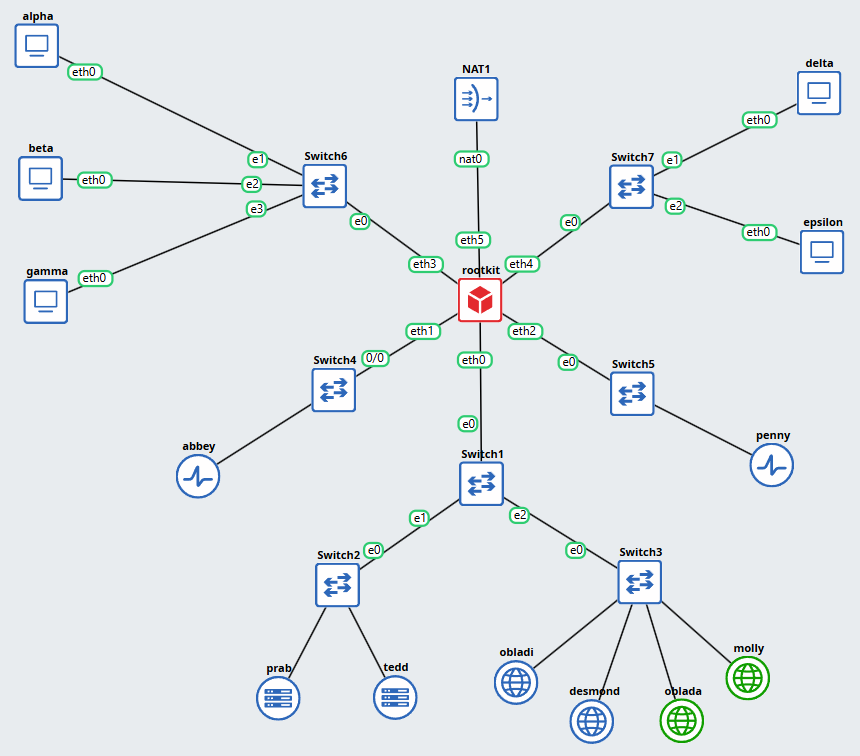

# Jarkom-Modul-2-2026-K-38

**Kelompok** : K-38

**Anggota** :

| Nama                 | NRP        | Soal  |
| -------------------- | ---------- | ----- |
| Farrel Arteya Kumara | 5027251020 | 1-10 |
| Nayla Arsha Adyuta   | 5027251042 | 11-20|


<br/>

#### Soal 1
Sebagai pusat kesadaran The Mesh, rootkit harus merentangkan koneksinya ke lima gerbang utama (Switch). Tetapkan alamat IP dan default gateway untuk seluruh Entitas, mulai dari para operator (alpha, beta, gamma), penjaga directory (prab, tedd), gerbang penyaring (abbey, penny), hingga repository (obladi, desmond, oblada, molly) sesuai dengan topologi pembagian switch yang dirancang.



- Subnet Klien 1: Terhubung melalui ```eth3``` pada ```rootkit``` menuju Switch6, yang melayani node klien ```alpha```, ```beta```, & ```gamma```
- Subnet Klien 2: Terhubung melalui ```eth4``` pada ```rootkit``` menuju Switch7, yang melayani node klien ```delta``` & ```epsilon```
- Subnet Tambahan: ```eth1``` pada ```rootkit``` terhubung ke Switch4 untuk melayani node ```abbey```, sedangkan antarmuka ```eth2``` terhubung ke Switcg5 untuk melayani node ```penny```
- Subner Server Utama: ```eth0``` pada ```rootkit``` terhubung ke Switch1 yang bertindak sebagai jembatan distribusi. Switch1 kemudian memecah jalur ke Switch2 untuk melayani server DNS (```prab``` dan ```tedd```), serta ke Switch3 untuk melayani kelompok server Web statis dan dinamis (```obladi```, ```desmond```, ```oblada```, ```molly```)

<br/>

Jalankan ```script-rootkit.sh``` di node rootkit. <br/>

```bash
bash script-rootkit.sh rootkit
```

Node lain. <br/>
```bash
sh script-rooter.sh <namanode>
```

Edit di ```/etc/network/interfaces``` 
```bash 
auto eth0
iface eth0 inet static
    address 192.230.1.1
    netmask 255.255.255.0

auto eth1
iface eth1 inet static
    address 192.230.4.1
    netmask 255.255.255.0

auto eth2
iface eth2 inet static
    address 192.230.5.1
    netmask 255.255.255.0

auto eth3
iface eth3 inet static
    address 192.230.6.1
    netmask 255.255.255.0

auto eth4
iface eth4 inet static
    address 192.230.7.1
    netmask 255.255.255.0

auto eth5
iface eth5 inet static
    address 192.168.122.200
    netmask 255.255.255.0
    gateway 192.168.122.1
    up echo nameserver 192.168.122.1 > /etc/resolv.conf
    up sysctl -w net.ipv4.ip_forward=1 || true
    up iptables -t nat -A POSTROUTING -s 192.230.0.0/16 -o eth5 -j MASQUERADE || true
```

<br/>

#### Soal 2
Meskipun The Mesh beroperasi dalam bayang-bayang, Rootkit menyadari bahwa Entitas di dalamnya masih membutuhkan asupan paket dari dunia luar. Buka jalur menuju NAT dengan memastikan antarmuka WAN di router rootkit aktif. Konfigurasikan NAT agar dapat meneruskan lalu lintas keluar bagi seluruh alamat internal, sehingga semua host di dalam jaringan dapat menjangkau internet publik menggunakan IP address. <br/>

Jalankan ```router-script-rootkit.sh``` di rootkit. <br/>

Tes dengan ```ping 8.8.8.8```

<br/>

#### Soal 3
Jaringan rahasia tidak akan berfungsi tanpa sinkronisasi antar divisi. Pastikan seluruh Entitas dapat saling terhubung dan berkomunikasi lintas jalur (routing internal via rootkit berfungsi). Untuk menghindari fragmentasi saat persiapan, pastikan setiap host non-router menambahkan resolver 192.168.122.1 (tambah di file /etc/resolv.conf, kalau sudah pakai resolver itu tidak perlu memasukkan resolver google) saat antarmukanya aktif agar akses untuk mengunduh paket instalasi dari internet tersedia sejak awal beroperasi.<br/>

Jalankan ```resolv.sh``` di seluruh node kecuali ```rootkit``` <br/>

```bash 
sh resolv.sh
```

<br/>

#### Soal 4
Penjaga Direktori mulai menuliskan hukum The Mesh. Pada node prab, bangun zona <xxxx>.com sebagai authoritative dengan SOA yang menunjuk ke prab.<xxxx>.com, serta tambahkan catatan NS untuk prab.<xxxx>.com dan tedd.<xxxx>.com. Buat A record untuk prab.<xxxx>.com dan tedd.<xxxx>.com yang mengarah ke alamat IP mereka masing-masing, serta A record apex <xxxx>.com yang mengarah ke gerbang aplikasi dinamis (penny). Aktifkan fitur notify dan allow-transfer ke tedd, lalu set forwarders ke 192.168.122.1. Di node tedd, tarik zona <xxxx>.com dari master dan pastikan server menjawab secara authoritative. Setelah fondasi nama ini berdiri kokoh, perbarui urutan resolver pada seluruh Entitas non-router menjadi: IP prab, IP tedd, lalu 192.168.122.1. Verifikasi bahwa query ke domain apex maupun hostname di dalam zona dijawab dengan benar oleh prab atau tedd. <br/>

Jalankan ```dns-master.sh``` di node ```prab``` <br/>

```bash
bash dns-master.sh
```

Jalankan ```dns-slave.sh``` di node ```tedd``` <br/>

```bash
bash dns-slave.sh
```

<br/>

#### Soal 5
"Entitas tanpa identitas adalah anomali," pesan Rootkit. Namai semua Entitas (hostname) sesuai glosarium: rootkit, alpha, beta, gamma, delta, epsilon, prab, tedd, abbey, penny, obladi, desmond, oblada, molly, dan verifikasi bahwa setiap host mengenali hostname tersebut secara system-wide. Buat setiap domain untuk masing-masing node sesuai dengan namanya (contoh: alpha.<xxxx>.com) dan assign IP masing-masing juga. Lakukan pengecualian untuk node yang bertanggung jawab atas prab dan tedd.

Jalankan ```host.sh``` di semua node. 

```bash
sh host.sh
```

Jalankan ```record-dns.sh``` di ```prab``` 

```bash
bash record-dns.sh
```

<br/>

#### Soal 6
Pastikan zone transfer berjalan, pastikan tedd telah menerima salinan zona terbaru dari prab. Nilai serial SOA di keduanya harus sama karena keduanya tidak bisa dipisahkan dan saling melengkapi. <br/>

Jalankan ```serial.sh``` di node ```prab``` 

```bash
bash serial.sh
```

Cek di node ```tedd```

```bash
dig @192.230.1.3 K38.com SOA +short
```

<br/>

#### Soal 7
abbey dan penny sebagai gerbang utama, obladi dan desmond sebagai web statis, oblada dan molly sebagai web dinamis. Tambahkan pada zona <xxxx>.com A record untuk vault.<xxxx>.com (IP obladi & desmond), dan core.<xxxx>.com (IP oblada & molly). Tetapkan CNAME:
- www.<xxxx>.com → penny.<xxxx>.com
- static.<xxxx>.com → abbey.<xxxx>.com
Verifikasi dari dua klien berbeda bahwa seluruh hostname tersebut ter-resolve ke tujuan yang benar dan konsisten.<br/>

Jalankan ```record-cname.sh``` di node ```prab```

```bash
bash record-cname.sh
```

Di node ```alpha``` jalankan ```check.sh``` untuk verifikasi.

```bash
sh check.sh
```

<br/>

#### Soal 8
Di prab (master) deklarasikan reverse zone untuk segmen jaringan  tempat abbey, penny, area vault, dan area core berada. Di tedd (slave) tarik reverse zone tersebut sebagai slave, isi PTR untuk keempat hostname itu agar pencarian balik IP address mengembalikan hostname yang benar, lalu pastikan query reverse untuk alamat abbey, penny, area vault, dan area core dijawab authoritative. <br/>

Jalankan ```query-reverse.sh``` di node ```prab```

```bash
bash query-reverse.sh
```

Jalankan ```query-reverse-slave.sh``` di node ```tedd```

```bash
bash query-reverse-slave.sh
```

Jalankan ```query-reverse-check.sh``` di node ```alpha``` untuk verifikasi.

```bash
query-reverse-check.sh
```

<br/>

#### Soal 9
Jalankan layanan web statis pada hostname di node area vault (menggunakan apache). Buka folder direktori /arsip/ dan aktifkan fitur autoindex (directory listing) pada konfigurasi Apache sehingga seluruh daftar file di dalamnya dapat ditelusuri langsung dari browser. Akses pengujian harus dilakukan melalui hostname, bukan IP address. <br/>

Jalankan ```web-server-statis.sh``` di node ```obladi```

```bash
bash web-server-statis.sh
```

<br/>

#### Soal 10
Jalankan layanan web dinamis (PHP-FPM) pada hostname di node core (menggunakan nginx). Buat sebuah aplikasi sederhana yang memuat halaman beranda dan halaman profil. Terapkan aturan rewrite pada server sehingga akses ke /profil dapat berfungsi dengan URL bersih (tanpa akhiran .php). Akses pengujian wajib dilakukan melalui hostname. <br/>

Jalankan ```web-dinamis-nginx.sh``` di node ```oblada```

```bash
bash web-dinamis-nginx.sh
```


