# Jarkom-Modul-2-2026-K-38

**Kelompok** : K-38

**Anggota** :

| Nama                 | NRP        | Soal  |
| -------------------- | ---------- | ----- |
| Farrel Arteya Kumara | 5027251020 | 1-10  |
| Nayla Arsha Adyuta   | 5027251042 | 11-20 |

<br/>

#### Soal 1

Sebagai pusat kesadaran The Mesh, rootkit harus merentangkan koneksinya ke lima gerbang utama (Switch). Tetapkan alamat IP dan default gateway untuk seluruh Entitas, mulai dari para operator (alpha, beta, gamma), penjaga directory (prab, tedd), gerbang penyaring (abbey, penny), hingga repository (obladi, desmond, oblada, molly) sesuai dengan topologi pembagian switch yang dirancang.


- Subnet Klien 1: Terhubung melalui `eth3` pada `rootkit` menuju Switch6, yang melayani node klien `alpha`, `beta`, & `gamma`
- Subnet Klien 2: Terhubung melalui `eth4` pada `rootkit` menuju Switch7, yang melayani node klien `delta` & `epsilon`
- Subnet Tambahan: `eth1` pada `rootkit` terhubung ke Switch4 untuk melayani node `abbey`, sedangkan antarmuka `eth2` terhubung ke Switcg5 untuk melayani node `penny`
- Subner Server Utama: `eth0` pada `rootkit` terhubung ke Switch1 yang bertindak sebagai jembatan distribusi. Switch1 kemudian memecah jalur ke Switch2 untuk melayani server DNS (`prab` dan `tedd`), serta ke Switch3 untuk melayani kelompok server Web statis dan dinamis (`obladi`, `desmond`, `oblada`, `molly`)

<br/>

Jalankan `script-rootkit.sh` di node rootkit. <br/>

```bash
bash script-rootkit.sh rootkit
```

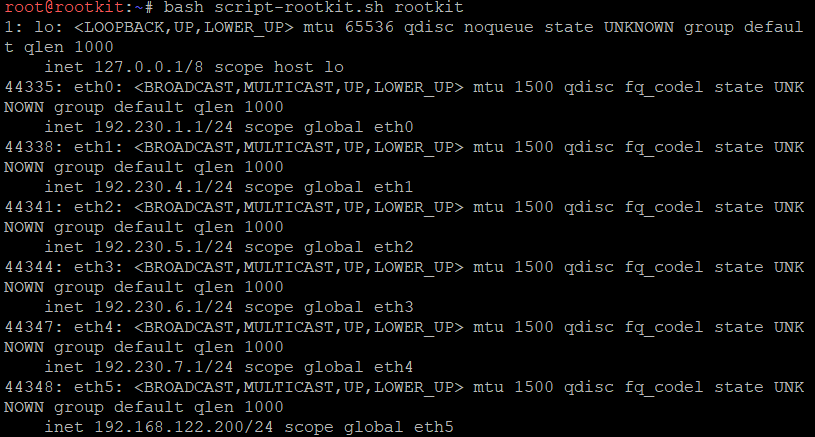

<br/>
Node lain. <br/>

```bash
sh script-rootkit.sh <nama node>
```

.png>)

<br/>

Gunakan node lain selain rootkit. Tetap di node `rootkit` untuk node `alpha`, `beta`, `gamma`, `delta`, `epsilon`, `abbey`, `penny`. <br/><br/>

Untuk node `prab`, `tedd`, `obladi`, `desmond`, `oblada`, `molly`, Jalankan di node masing masing dengan akhir an sesuai nama node nya. <br/>

```bash
sh script-rootkit.sh <nama node>
```

<br/>

Edit di `/etc/network/interfaces`

```bash
auto eth0
iface eth0 inet static
    address 192.230.1.1
    netmask 255.255.255.0

auto eth1
iface eth1 inet static
    address 192.230.4.1
    netmask 255.255.255.0

auto eth2
iface eth2 inet static
    address 192.230.5.1
    netmask 255.255.255.0

auto eth3
iface eth3 inet static
    address 192.230.6.1
    netmask 255.255.255.0

auto eth4
iface eth4 inet static
    address 192.230.7.1
    netmask 255.255.255.0

auto eth5
iface eth5 inet static
    address 192.168.122.200
    netmask 255.255.255.0
    gateway 192.168.122.1
    up echo nameserver 192.168.122.1 > /etc/resolv.conf
    up sysctl -w net.ipv4.ip_forward=1 || true
    up iptables -t nat -A POSTROUTING -s 192.230.0.0/16 -o eth5 -j MASQUERADE || true
```

<br/>

#### Soal 2

Meskipun The Mesh beroperasi dalam bayang-bayang, Rootkit menyadari bahwa Entitas di dalamnya masih membutuhkan asupan paket dari dunia luar. Buka jalur menuju NAT dengan memastikan antarmuka WAN di router rootkit aktif. Konfigurasikan NAT agar dapat meneruskan lalu lintas keluar bagi seluruh alamat internal, sehingga semua host di dalam jaringan dapat menjangkau internet publik menggunakan IP address. <br/>

Jalankan `router-script-rootkit.sh` di rootkit. <br/>
Tes dengan `ping 8.8.8.8` <br/>

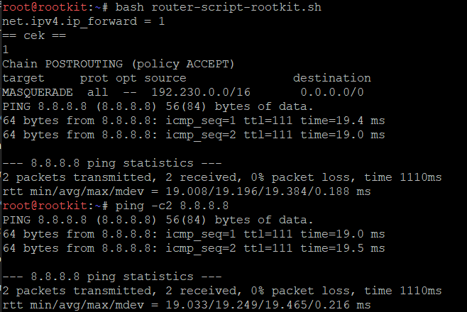

<br/>

#### Soal 3

Jaringan rahasia tidak akan berfungsi tanpa sinkronisasi antar divisi. Pastikan seluruh Entitas dapat saling terhubung dan berkomunikasi lintas jalur (routing internal via rootkit berfungsi). Untuk menghindari fragmentasi saat persiapan, pastikan setiap host non-router menambahkan resolver 192.168.122.1 (tambah di file /etc/resolv.conf, kalau sudah pakai resolver itu tidak perlu memasukkan resolver google) saat antarmukanya aktif agar akses untuk mengunduh paket instalasi dari internet tersedia sejak awal beroperasi.<br/>

Jalankan `node.sh` di seluruh node kecuali `rootkit` <br/>

```bash
sh node.sh
```

Jalankan `check.sh` di node manapun

```bash
sh check.sh
```

<br/>

#### Soal 4

Penjaga Direktori mulai menuliskan hukum The Mesh. Pada node prab, bangun zona <xxxx>.com sebagai authoritative dengan SOA yang menunjuk ke prab.<xxxx>.com, serta tambahkan catatan NS untuk prab.<xxxx>.com dan tedd.<xxxx>.com. Buat A record untuk prab.<xxxx>.com dan tedd.<xxxx>.com yang mengarah ke alamat IP mereka masing-masing, serta A record apex <xxxx>.com yang mengarah ke gerbang aplikasi dinamis (penny). Aktifkan fitur notify dan allow-transfer ke tedd, lalu set forwarders ke 192.168.122.1. Di node tedd, tarik zona <xxxx>.com dari master dan pastikan server menjawab secara authoritative. Setelah fondasi nama ini berdiri kokoh, perbarui urutan resolver pada seluruh Entitas non-router menjadi: IP prab, IP tedd, lalu 192.168.122.1. Verifikasi bahwa query ke domain apex maupun hostname di dalam zona dijawab dengan benar oleh prab atau tedd. <br/>

Jalankan `dns-master.sh` di node `prab` <br/>

```bash
bash dns-master.sh
```

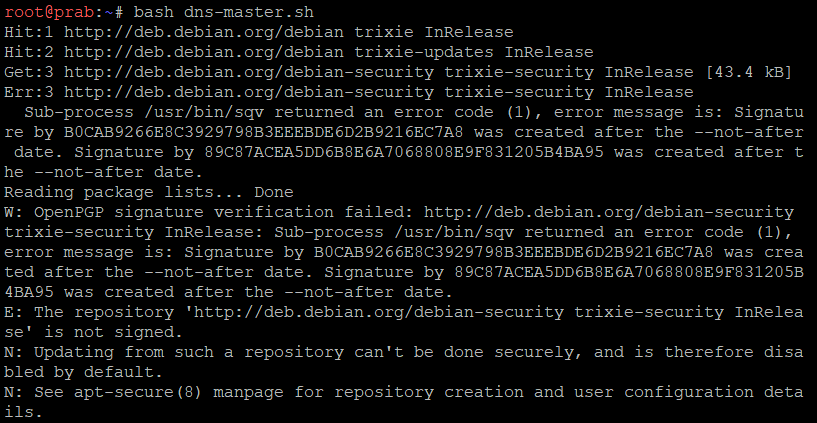

<br/>

Jalankan `dns-slave.sh` di node `tedd` <br/>

```bash
bash dns-slave.sh
```

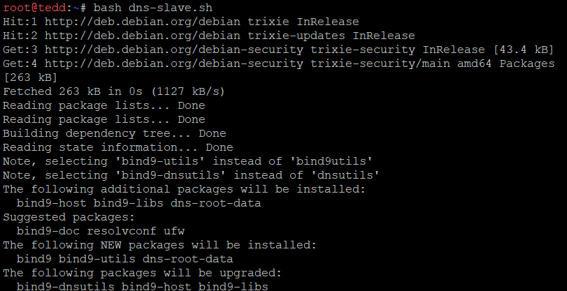

<br/>

Jalankan `resolv.sh` di seluruh node kecuali `rootkit` <br/>

```bash
sh resolv.sh
```

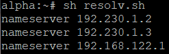
<br/>

<br/>

#### Soal 5

"Entitas tanpa identitas adalah anomali," pesan Rootkit. Namai semua Entitas (hostname) sesuai glosarium: rootkit, alpha, beta, gamma, delta, epsilon, prab, tedd, abbey, penny, obladi, desmond, oblada, molly, dan verifikasi bahwa setiap host mengenali hostname tersebut secara system-wide. Buat setiap domain untuk masing-masing node sesuai dengan namanya (contoh: alpha.<xxxx>.com) dan assign IP masing-masing juga. Lakukan pengecualian untuk node yang bertanggung jawab atas prab dan tedd.

Jalankan `host.sh` di semua node.

```bash
sh host.sh <nama node>
```

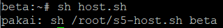

<br/>

Jalankan `record-dns.sh` di `prab`

```bash
bash record-dns.sh
```

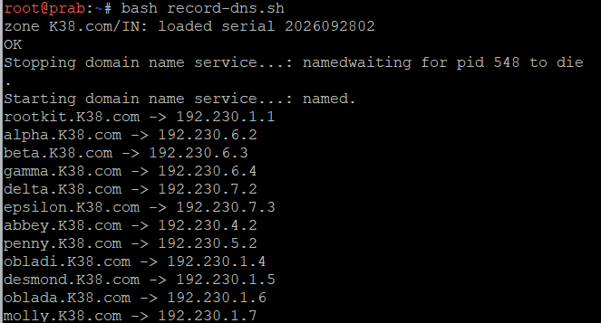

<br/>

#### Soal 6

Pastikan zone transfer berjalan, pastikan tedd telah menerima salinan zona terbaru dari prab. Nilai serial SOA di keduanya harus sama karena keduanya tidak bisa dipisahkan dan saling melengkapi. <br/>

Jalankan `serial.sh` di node `prab`

```bash
bash serial.sh
```

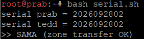

<br/>

Cek di node `tedd`

```bash
dig @192.230.1.3 K38.com SOA +short
```

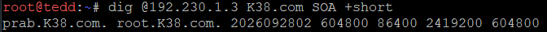

<br/>

#### Soal 7

abbey dan penny sebagai gerbang utama, obladi dan desmond sebagai web statis, oblada dan molly sebagai web dinamis. Tambahkan pada zona <xxxx>.com A record untuk vault.<xxxx>.com (IP obladi & desmond), dan core.<xxxx>.com (IP oblada & molly). Tetapkan CNAME:

- www.<xxxx>.com → penny.<xxxx>.com
- static.<xxxx>.com → abbey.<xxxx>.com
  Verifikasi dari dua klien berbeda bahwa seluruh hostname tersebut ter-resolve ke tujuan yang benar dan konsisten.<br/>

Jalankan `record-cname.sh` di node `prab`

```bash
bash record-cname.sh
```

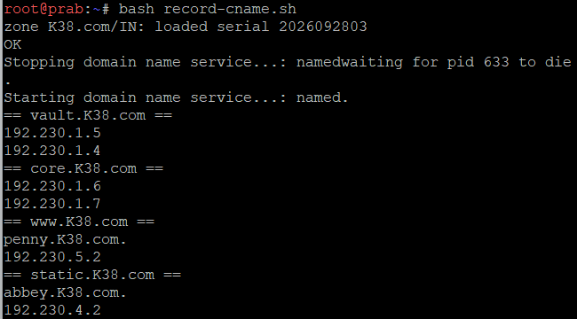

<br/>

Di node `alpha` jalankan `record-check.sh` untuk verifikasi.

```bash
sh record-check.sh
```

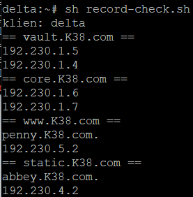

<br/>

#### Soal 8

Di prab (master) deklarasikan reverse zone untuk segmen jaringan tempat abbey, penny, area vault, dan area core berada. Di tedd (slave) tarik reverse zone tersebut sebagai slave, isi PTR untuk keempat hostname itu agar pencarian balik IP address mengembalikan hostname yang benar, lalu pastikan query reverse untuk alamat abbey, penny, area vault, dan area core dijawab authoritative. <br/>

Jalankan `query-reverse.sh` di node `prab`

```bash
bash query-reverse.sh
```

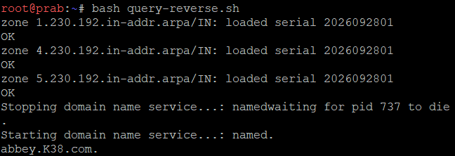

<br/>

Jalankan `query-reverse-slave.sh` di node `tedd`

```bash
bash query-reverse-slave.sh
```

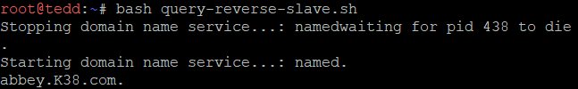

<br/>

Jalankan `sh reverse-query-check.sh` di node `alpha` untuk verifikasi.

```bash
sh reverse-query-check.sh
```

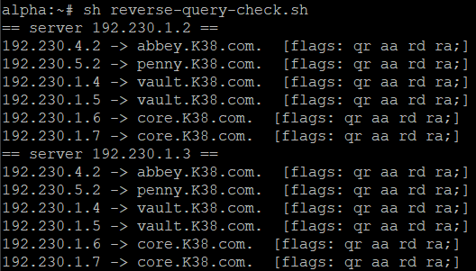

<br/>

#### Soal 9

Jalankan layanan web statis pada hostname di node area vault (menggunakan apache). Buka folder direktori /arsip/ dan aktifkan fitur autoindex (directory listing) pada konfigurasi Apache sehingga seluruh daftar file di dalamnya dapat ditelusuri langsung dari browser. Akses pengujian harus dilakukan melalui hostname, bukan IP address. <br/>

Jalankan `web-server-statis.sh` di node `obladi`

```bash
bash web-server-statis.sh
```

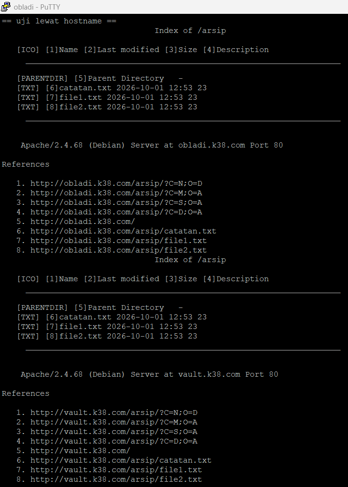

<br/>

#### Soal 10

Jalankan layanan web dinamis (PHP-FPM) pada hostname di node core (menggunakan nginx). Buat sebuah aplikasi sederhana yang memuat halaman beranda dan halaman profil. Terapkan aturan rewrite pada server sehingga akses ke /profil dapat berfungsi dengan URL bersih (tanpa akhiran .php). Akses pengujian wajib dilakukan melalui hostname. <br/>

Jalankan `web-dinamis-nginx.sh` di node `oblada`

```bash
bash web-dinamis-nginx.sh
```

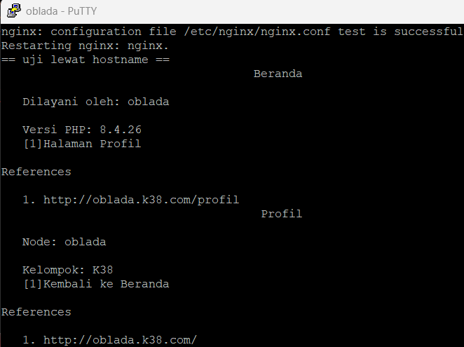

<br/>

Jalankan `bash check-1-10.sh` di `alpha`, semua baris harus `OK`. Khusus `desmond`, pastikan `web-server-statis.sh` (soal 9) juga sudah dijalankan di sana, bukan cuma di `obladi`.

#### Soal 11

Konfigurasikan Penny (menggunakan Apache) sebagai reverse proxy yang mengarah ke semua node di area vault (Obladi & Desmond). Sementara itu, konfigurasikan Abbey (menggunakan Nginx) sebagai reverse proxy menuju area core (Oblada & Molly). Pastikan kedua gerbang ini meneruskan identitas asli pengunjung ke server backend dengan melakukan forwarding header Host dan X-Real-IP. Buktikan bahwa Penny dan Abbey berhasil mendistribusikan lalu lintas dengan tepat.<br/>

Jalankan `setup-penny.sh` di node `penny`

```bash
bash setup-penny.sh
```

Script ini memasang Apache, mengaktifkan modul `proxy`, `proxy_http`, `proxy_balancer`, `lbmethod_byrequests`, `headers`, lalu membuat vhost `www.K38.com` dengan balancer ke `obladi` (192.230.1.4) dan `desmond` (192.230.1.5). Header `Host` diteruskan dengan `ProxyPreserveHost On`, sedangkan `X-Real-IP` diisi dengan `RequestHeader set X-Real-IP`.

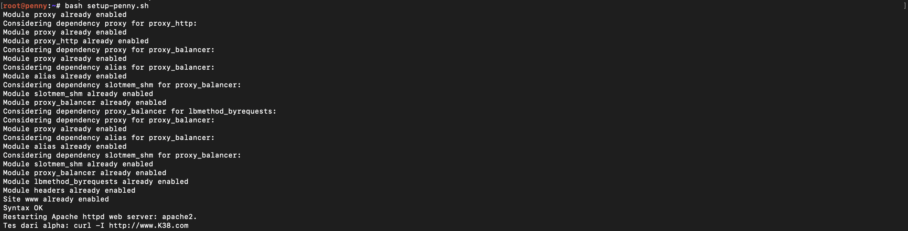

<br/>

Jalankan `setup-abbey.sh` di node `abbey`

```bash
bash setup-abbey.sh
```

Script ini memasang Nginx dan membuat `upstream corecluster` ke `oblada` (192.230.1.6) dan `molly` (192.230.1.7), dengan `proxy_set_header Host` dan `X-Real-IP`.

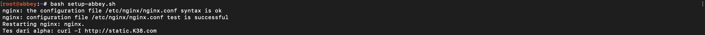

<br/>

Bukti dari `alpha`: respon bergantian antar backend

```bash
curl -I http://www.K38.com
curl -I http://static.K38.com
for i in 1 2 3 4; do curl -s http://www.K38.com/; echo; done
for i in 1 2 3 4; do curl -s http://static.K38.com/ | grep -o 'Dilayani oleh: [a-z]*'; done
```

`www` harus bergantian `Vault - obladi` / `Vault - desmond`, dan `static` bergantian `oblada` / `molly`.

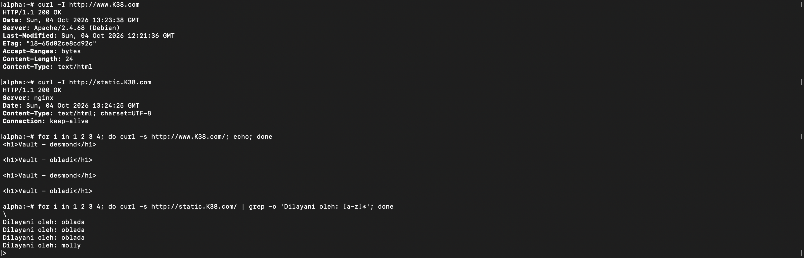

<br/>

#### Soal 12

Terdapat ruang khusus di penny yang yang menyimpan dokumen rahasia sindikat, oleh karena itu terapkan perlindungan basic authentication untuk path /admin. Akses ke jalur tersebut harus menolak pengunjung tanpa kredensial, dan hanya mengizinkan masuk jika menggunakan credential berikut:

| username | password                    |
| -------- | --------------------------- |
| prabs    | pakar_pinter_jadi_gob\*\*\* |

<br/>

Jalankan `admin-page.sh` di node `obladi` **dan** `desmond` (halaman target `/admin`)

```bash
bash admin-page.sh
```

Script membuat `/admin/index.html` berisi `ADMIN <hostname>` di `/var/www/vault.K38.com` dan `/var/www/html`, jadi tetap benar apapun vhost yang aktif di node itu.

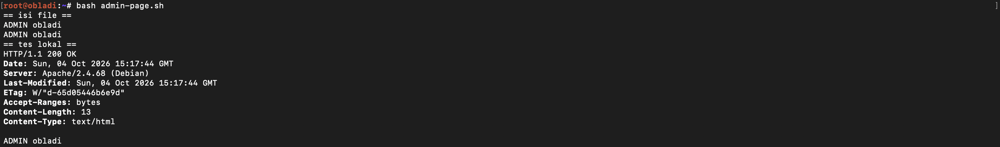
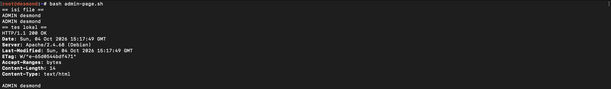

<br/>

Jalankan `secret.sh` di node `penny`

```bash
bash secret.sh
```

Script membuat `/etc/apache2/.htpasswd` lewat `htpasswd`, lalu menulis `/etc/apache2/snippets/www-auth.conf` (blok `<Location "/admin">` dengan `AuthType Basic`). File snippet ini di-include `www.conf` sebelum `ProxyPass /`.

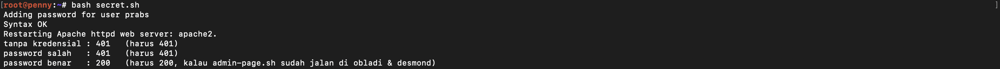

<br/>

Tes dari `alpha`

```bash
curl -i http://www.K38.com/admin/                                          # 401
curl -i -u 'prabs:salah' http://www.K38.com/admin/                         # 401
curl -i -u 'prabs:pakar_pinter_jadi_gob***' http://www.K38.com/admin/      # 200 (ADMIN obladi / ADMIN desmond)
```

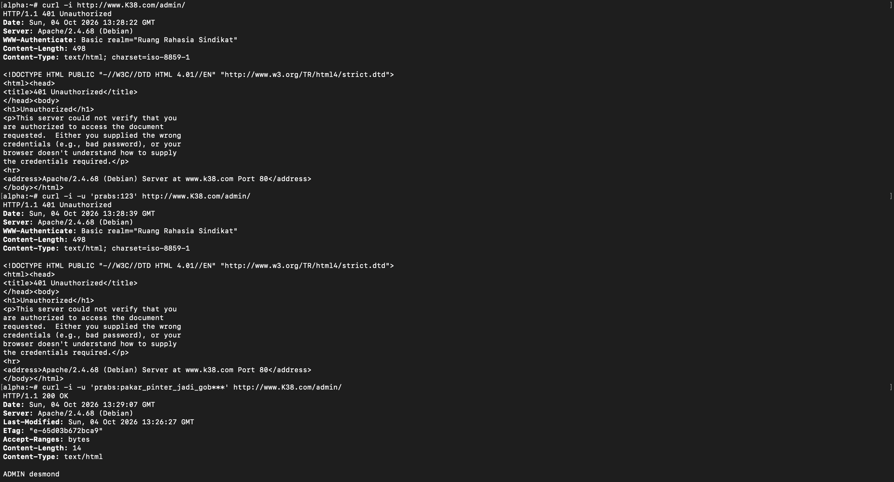

<br/>

#### Soal 13

Setiap entitas dari luar harus memanggil gerbang dengan nama kanoniknya. Jika ada yang mencoba mengakses IP penny dan domain penny.xxx.com, paksa sistem untuk melakukan redirect secara permanen (status code 301) menuju www.xxx.com. Sebaliknya, jika ada yang mengakses IP abbey dan domain abbey.xxx.com, lakukan redirect sementara (status code 302) menuju static.xxx.com.<br/>

Jalankan `redirect-penny.sh` di node `penny`

```bash
bash redirect-penny.sh
```

vhost `00-redirect.conf` dimuat lebih dulu dari `www.conf`, sehingga request dengan Host selain `www.K38.com` (termasuk lewat IP) jatuh ke vhost ini dan di-redirect 301.

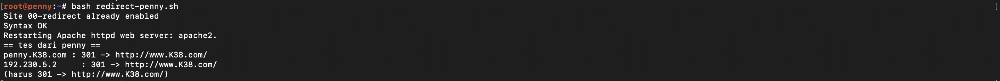

<br/>

Jalankan `redirect-abbey.sh` di node `abbey` (setelah `setup-abbey.sh`)

```bash
bash redirect-abbey.sh
```

Server block `default_server` di `/etc/nginx/conf.d/00-redirect.conf` mengembalikan 302 ke `static.K38.com`.

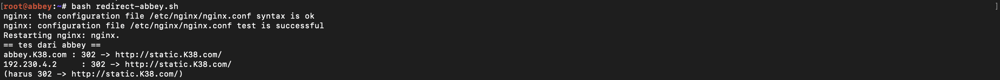

<br/>

Tes dari `alpha`

```bash
curl -I http://penny.K38.com     # 301 -> http://www.K38.com/
curl -I http://192.230.5.2       # 301 -> http://www.K38.com/
curl -I http://abbey.K38.com     # 302 -> http://static.K38.com/
curl -I http://192.230.4.2       # 302 -> http://static.K38.com/
```

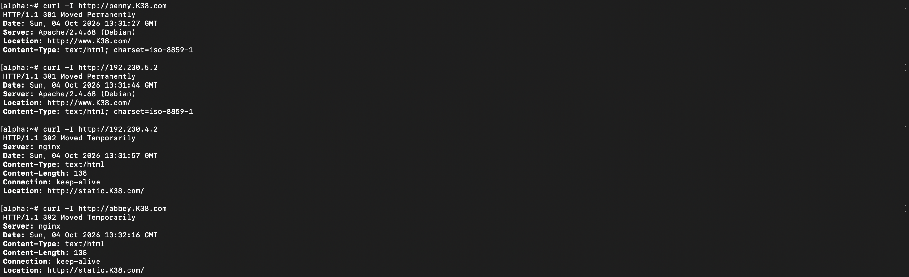

<br/>

#### Soal 14

Di dalam The Mesh, rekam jejak tidak boleh dipalsukan oleh sistem. Pastikan access log pada setiap server web di area vault maupun area core mencatat alamat IP asli milik client (pengunjung) yang diteruskan oleh gerbang, dan bukan mencatat IP dari Penny ataupun Abbey.<br/>

Jalankan `realip-vault.sh` di node `obladi` dan `desmond` (Apache, pakai `mod_remoteip`)

```bash
bash realip-vault.sh
```

Jalankan `realip-core.sh` di node `oblada` dan `molly` (Nginx, pakai `set_real_ip_from` + `real_ip_header X-Real-IP`)

```bash
bash realip-core.sh
```

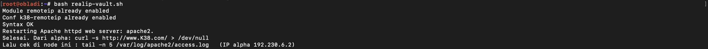
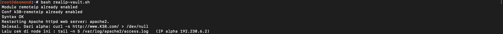
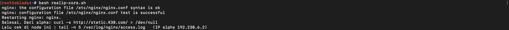
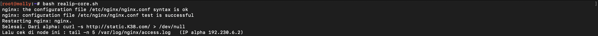

<br/>

Dari `alpha` buat beberapa request (supaya kedua backend kebagian)

```bash
for i in 1 2 3 4; do curl -s http://www.K38.com/ > /dev/null; curl -s http://static.K38.com/ > /dev/null; done
```

Cek log di backend, yang tercatat harus IP alpha `192.230.6.2`, bukan IP penny `192.230.5.2` atau abbey `192.230.4.2`.

```bash
tail -n 5 /var/log/apache2/access.log     # di obladi & desmond
tail -n 5 /var/log/nginx/access.log       # di oblada & molly
```

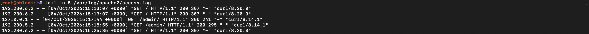
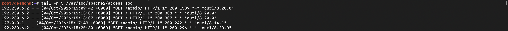
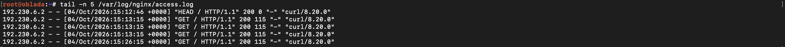
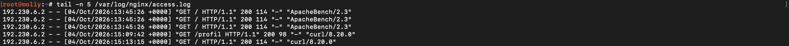

<br/>

#### Soal 15

Rootkit menginstruksikan pembuatan jalur proxy khusus yang berdiri sendiri. Pada penny buat reverse proxy untuk path /eternal yang menyajikan directory /var/www/eternal, dan pastikan path ini dapat mengeksekusi (rendering) file php. Pada abbey, buat jalur /orion yang menyajikan directory /var/www/orion, secara murni statis tanpa perlu rendering php.<br/>

Jalankan `eternal-penny.sh` di node `penny`

```bash
bash eternal-penny.sh
```

Script memasang `php-fpm`, mengaktifkan `proxy_fcgi`, membuat `/var/www/eternal/index.php`, lalu menulis `/etc/apache2/snippets/www-eternal.conf`: `ProxyPass /eternal !` (dikecualikan dari balancer vault), `Alias /eternal /var/www/eternal`, dan file `.php` diteruskan ke socket PHP-FPM lewat `SetHandler "proxy:unix:...|fcgi://localhost"`.

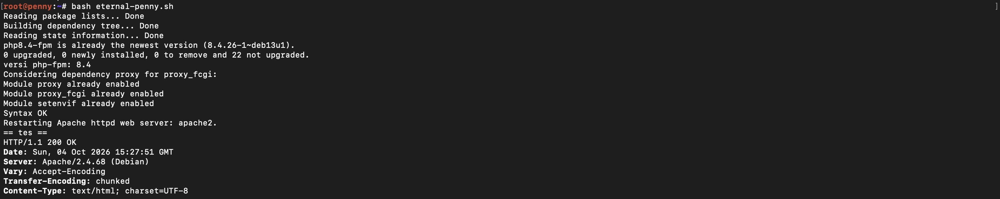

<br/>

Jalankan `orion-abbey.sh` di node `abbey`

```bash
bash orion-abbey.sh
```

Script menulis `/etc/nginx/k38-snippets/static-orion.conf` (`location /orion/` dengan `alias /var/www/orion/`). Tidak ada handler PHP, jadi `test.php` hanya tampil/terunduh apa adanya.

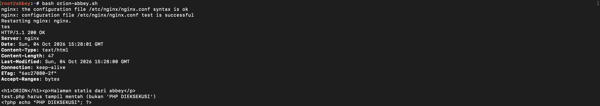

<br/>

Tes dari `alpha`

```bash
curl -i http://www.K38.com/eternal/        # 200, tampil "SAPI: fpm-fcgi" (php dirender)
curl -i http://static.K38.com/orion/       # 200, halaman statis
curl http://static.K38.com/orion/test.php  # tampil mentah lengkap dengan <?php ... ?> (artinya php tidak dieksekusi)
```

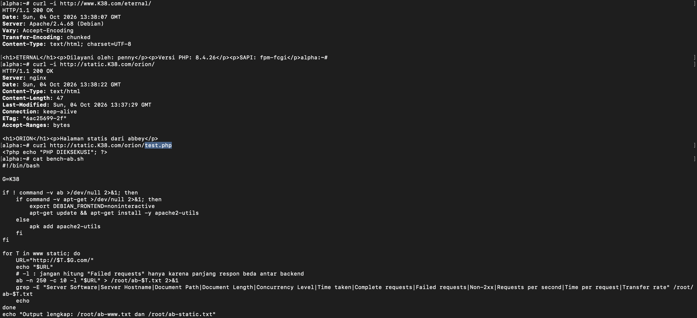

<br/>

#### Soal 16

Ketahanan gerbang The Mesh harus diuji untuk menghadapi bombardir permintaan. Salah satu Klien (misal: Alpha) bertugas melakukan stress test benchmark menggunakan ApacheBench. Lakukan 250 requests dengan tingkat konkurensi (concurrencies) 10 untuk masing - masing titik akhir: www.xxx.com dan static.xxx.com. Tampilkan rangkuman hasilnya.<br/>

Jalankan `bench-ab.sh` di node `alpha`

```bash
bash bench-ab.sh
```

Perintah intinya `ab -n 250 -c 10 -l http://www.K38.com/` dan `ab -n 250 -c 10 -l http://static.K38.com/`. Opsi `-l` dipakai karena panjang respon tiap backend berbeda (nama hostname di halaman), tanpa `-l` ab salah menghitungnya sebagai "Failed requests". Pastikan `Complete requests: 250` dan `Failed requests: 0`.

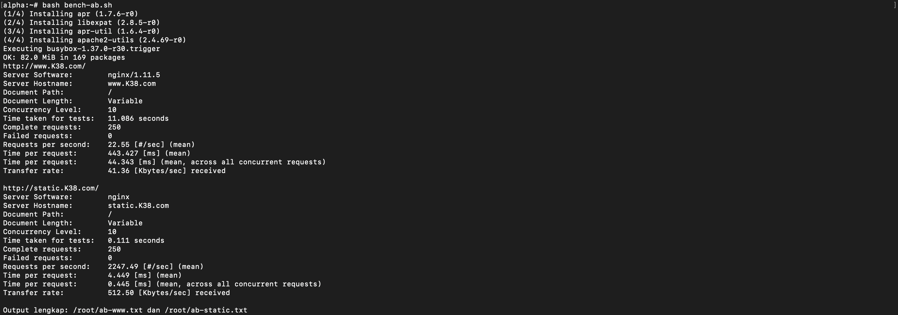

<br/>

#### Soal 17

Tambahkan TXT record pada DNS untuk semua klien sayap kiri dan sayap kanan (Alpha, Beta, Gamma, Delta, Epsilon). Jika DNS di-query TXT terhadap nama domain mereka (contoh: alpha.<xxxx>.com), sistem harus mengembalikan teks berupa nama hostname mereka masing-masing (contoh: "alpha").<br/>

Jalankan `record-txt.sh` di node `prab`

```bash
bash record-txt.sh
```

Script menambah record `TXT` ke `/etc/bind/jarkom/K38.com`, menaikkan serial, reload bind, lalu mengecek jawaban prab dan tedd (serial harus sama).

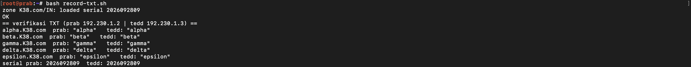

<br/>

Tes dari `alpha`

```bash
dig +short TXT alpha.K38.com     # "alpha"
dig +short TXT epsilon.K38.com   # "epsilon"
```

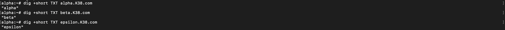

<br/>

#### Soal 18

Ubah A record DNS milik abbey.xxx.com ke alamat IP yang fiktif (ubah secara random namun pastikan format IP valid). Naikkan nilai serial SOA di prab dan pastikan tedd ikut tersinkron. Tetapkan TTL sebesar 15 detik pada record yang relevan tersebut. Verifikasi momen yang terjadi pada tiga fase pencarian: sebelum perubahan terjadi (mengembalikan IP lama), saat perubahan baru saja terjadi dalam jeda 15 detik (masih IP lama karena cache), dan setelah batas waktu TTL habis (berubah ke IP fiktif yang baru).<br/>

Jalankan `ttl-abbey.sh` di node `prab`

```bash
bash ttl-abbey.sh demo
```

prab dan tedd adalah server authoritative, jawabannya selalu data terbaru dan tidak pernah "ketahan cache". Supaya fase 2 (masih IP lama) bisa diperlihatkan, script memasang resolver cache `dnsmasq` di `127.0.0.1:5353` yang meneruskan ke named lokal. Urutan yang dijalankan otomatis:

1. abbey diset TTL 15 dengan IP lama `192.230.4.2`, lalu **fase 1**: query lewat cache menghasilkan IP lama.
2. abbey diubah ke IP fiktif acak `203.0.113.x`, serial dinaikkan, bind di-reload.
3. **fase 2**: query langsung setelah perubahan masih IP lama, dan TTL yang tampil menurun (tanda dari cache).
4. tunggu 16 detik, **fase 3**: query menghasilkan IP fiktif yang baru.
5. serial prab dan tedd dicek sama, dan tedd menjawab IP baru.

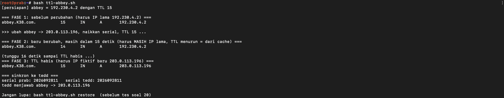

<br/>

Sebelum lanjut ke soal 20, kembalikan abbey ke normal:

```bash
bash ttl-abbey.sh restore
```

> Jangan menjalankan ulang `record-dns.sh` (soal 5) saat abbey sedang dalam mode fiktif, karena script itu akan menambah lagi A record `abbey` dengan IP lama.

<br/>

#### Soal 19

Last? But not least? Buat CNAME record yang melakukan binding dari domain internal outbound.xxx.com menuju domain eksternal http.badssl.com, Lakukan perintah curl ke http://outbound.xxx.com dan pastikan output yang dihasilkan sesuai dengan isi konten di halaman http.badssl.com.<br/>

Jalankan `outbound-cname.sh` di node `prab`

```bash
bash outbound-cname.sh
```

Script menambah `outbound IN CNAME http.badssl.com.` dan menaikkan serial. Karena targetnya di luar zona, server harus mau melakukan recursion untuk klien, jadi `named.conf.options` ditambah `recursion yes;` dan `allow-recursion { any; };`. Tanpa itu klien hanya menerima CNAME tanpa IP dan `curl` gagal resolve.

Jalankan `allow-recursion.sh` di node `tedd` (pengaturan yang sama, supaya tedd juga bisa jadi cadangan)

```bash
bash allow-recursion.sh
```

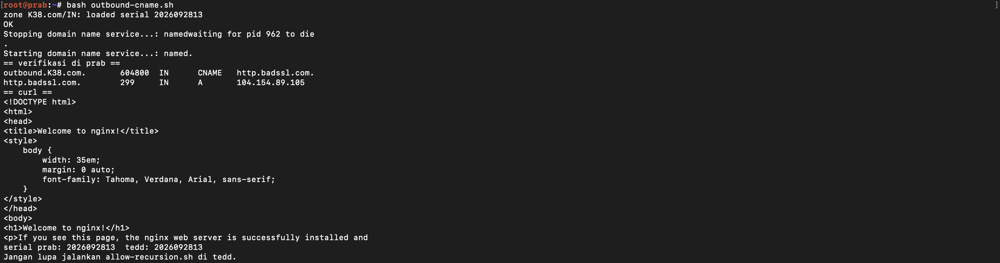
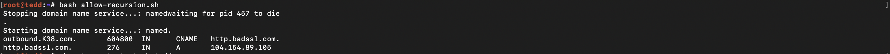

<br/>

Tes dari `alpha`

```bash
dig outbound.K38.com +noall +answer                         # bukti CNAME -> http.badssl.com + IP-nya
curl http://http.badssl.com                                 # halaman acuan (merah, title http.badssl.com)
curl -H 'Host: http.badssl.com' http://outbound.K38.com     # harus sama dengan acuan
```

`curl http://outbound.K38.com` tanpa header menampilkan halaman default nginx. Itu bukan karena DNS salah, tapi karena server badssl memilih situs berdasarkan header `Host`, sedangkan `curl` polos mengirim `Host: outbound.K38.com` yang tidak dikenalnya. CNAME hanya mengubah nama menjadi IP, tidak mengubah header Host. Jadi untuk mendapat isi yang sama dengan `http.badssl.com`, header Host harus disetel ke `http.badssl.com`.

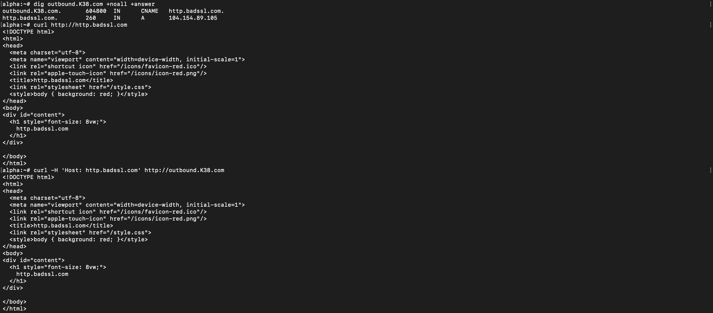

<br/>

#### Soal 20

Setelah semua penyelesaian selesai, pastikan semua service dan konfigurasi yang telah dikerjakan dari awal tetap berjalan normal dan berstatus autostart saat node di-restart (khusus untuk kasus ini, abaikan konfigurasi nomor 18 dan biarkan koordinat kembali normal).<br/>

Pertama, kembalikan konfigurasi soal 18 (di `prab`):

```bash
bash ttl-abbey.sh restore
```

Kedua, jalankan `setup-autostart.sh` di **setiap** node dengan argumen nama node-nya:

```bash
sh setup-autostart.sh <nama node>     # contoh: sh setup-autostart.sh penny
```

Script ini menulis `/root/autostart.sh` yang tiap dijalankan akan memastikan:

- IP, gateway, serta NAT dan IP forwarding untuk `rootkit`
- hostname dan `/etc/hosts`
- `/etc/resolv.conf` (prab, tedd, 192.168.122.1; khusus rootkit 192.168.122.1)
- service sesuai peran node, yaitu `named` (prab, tedd), `apache2` (penny, obladi, desmond), `nginx` (abbey, oblada, molly), dan `php-fpm` (penny, oblada, molly)

`autostart.sh` dipanggil dari `/root/.bashrc` dan `/root/.profile`, jadi berjalan otomatis setiap console node dibuka setelah restart. Script aman dijalankan berulang karena hanya menjalankan yang belum aktif. Lognya ada di `/root/autostart.log`.

<br/>

Ketiga, stop lalu start semua node di GNS3, buka console masing-masing, lalu dari `alpha` jalankan:

```bash
bash check-11-20.sh
```

Semua baris harus berstatus `OK`. Kalau ada service yang gagal, lihat `cat /root/autostart.log` di node tersebut.

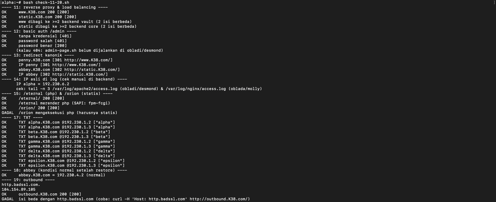
